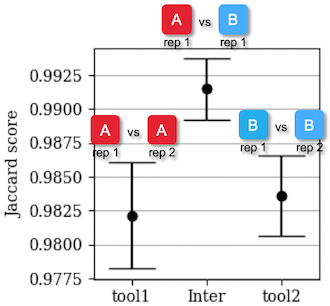

# Functional Equivalence Workflow

## Usage

### Inputs

Generally, the workflow is designed to operate on a `sample_set` in the Terra data model. If the main data table is called `sample` then the array inputs for this workflow should be provided as `this.samples.[column name]`

Required arguments:
- `Array[String] sample_id`: Only used for iterating over the the rows, can be arbitrary.
- `Array[String] dataset`: Dataset name that must be shared for all samples that should be compared to each other. **Must not contain a period (`.`).**
- `Array[String] confidence_intervals`: Confidence intervals where the analysis should be carried out. Should be the same for each replicate within a dataset.
- `String tool1_label`: Label the tool1 VCFs.
- `Array[String] tool1_vcf`: The VCF generated with tool 1.
- `Array[String] tool1_vcf_index`
- `String tool2_label`: Label the tool2 VCFs.
- `Array[String] tool2_vcf`: The VCF generated with tool 2.
- `Array[String] tool2_vcf_index`
- `Array[String] truth_vcf`: A truth VCF, if available. **If no truth is available for a given row, this field must be set to the string `"null"` and must not be left empty.**
- `Array[String] truth_vcf_index`: A truth VCF index, if available. **If no truth is available for a given row, this field must be set to the string `"null"` and must not be left empty.**
- `Array[String]? stratLabels`: Labels for an arbitrary number of intervals for which to produce output statistics and plots.
- `Array[File]? stratIntervals`: Interval files corresponding to the labels in `stratLabels`. Supported file types are `.interval_list` and `.bed`.
- `String referenceVersion = "hg38"`: Required for the call to the BenchmarkVCFs subworkflow.
- `File reference`: .fasta
- `File refIndex`: .fai
- `File refDict`: .dict
- `File hapMap`: Required for the call to the BenchmarkVCFs subworkflow. For hg38, use `"gs://gcp-public-data--broad-references/hg38/v0/Homo_sapiens_assembly38.haplotype_database.txt"`

Optional arguments:
- `String? additional_label`: Optional label that will be displayed on the plots to distinguish, for example, different tool versions.
- `String gatkTag = "4.0.11.0"`: GATK Docker tag to use in various sub-tasks.
- `Boolean passingOnly = true`: When this is true, only calls that pass the VCF filters will be considered for the evaluation.
- `Boolean requireMatchingGenotypes = true`: When this is false, the ploidy of calls will be ignored. (see `--squash-ploidy` documentation for `vcfeval`).
- `String vcfScoreField = "QUAL"`: Column in the VCFs to use for generating ROC and F1 plots (see documentaion for `vcfeval`).
- `Int? preemptible = 3`: Number of preemtible attempts for all tasks.
- `Int? threadsVcfEval = 2`: Number of threads to use for `vcfeval`.

### Outputs
- `Array[File] fe_plots`: Array of FE plots for each dataset.
- `Array[File] f1_plots`: Array of F1 plots for each dataset.
- `Array[File] roc_plots`: Array of ROC plots for each dataset.
- `File merged_fe_plots`: All FE plots concatenated into one PNG.
- `File merged_f1_plots`: All F1 plots concatenated into one PNG.
- `File merged_roc_plots`: All ROC plots concatenated into one PNG.
- `File fe_summary`: TSV file containing all the data visualized in the FE plots.
- `File f1_summary`: TSV file containing all the data visualized in the F1 plots.

## Background
This workflow is used to evaluate functional equivalence between two callsets. It has been developed for evaluating the concordance between DRAGEN and DRAGEN-GATK but has since been generalized to be applicable for comparisons between two arbitrary sets of VCF files.

The general principle of the evaluation is to compare the differences between multiple replicates called with the same set of tools (intra tool difference) to the differences between the output of different sets of tools on the same replicate (inter tool difference), respectively:

If more than two replicates are provided, multiple comparisons are performed, e.g. for intra tool comparisons comparing Tool1rep1 vs Tool1rep2, Tool1rep1 vs Tool1rep3, Tool1rep2 vs Tool1rep3, ... and for inter tool comparisons comparing Tool1rep1 vs Tool2rep1, Tool1rep2 vs Tool2rep2, Tool1rep3 vs Tool2rep3, ...

The workflow evaluates both the **concordance** (visualized by FE plots) as well as the **performance difference** (visualized by F1 plots) between samples. 

### FE plots

Functional Equivalence (FE) plots visualize the intra and inter tool concordance between samples by running `vcfeval` with one sample arbitrarily defined as truth and the other one as the evaluation sample. Subsequently, a Jaccard score is calculated as

J = TP / (TP + FP + FN)

where TP refers to calls that are in both sample 1 and sample 2, and FP and FN refer to calls that are in one sample but not the other. A higher score relates to a high concordance or more similar calls. Note that the terms _true positive_, _false positive_ and _false negative_ only represent the output from `vcfeval` and do not reflect any relation to acutal _true_ calls, since no actual _truth_ VCF is provided for this comparison.

An example FE plot (with annotations added for clarity) is shown below:

The left bars represent the intra tool concordance when comparing different replicates called with DRAGEN and the right bars represent the intra tool concordance between samples called with GATK. The middle bar represents the inter tool concordance.

The points in the bars refer to the mean Jaccard score among the comparisons with multiple replicates and the error bars represents the standard deviation.

**If the middle bars are above the outer bars then the inter tool difference is smaller than the intra tool difference.**

### F1 plots

For evaluating performance differences between tools, F1 plots are also created:

In this plot, the absolute difference in F1 score vs. truth for a given quality threshold is visualized. In the above plot, we can expect a mean intra tool difference between replicates called with GATK of 0.002 when filtering with a quality threshold of 10. That means, if the F1 score hard-filtered with that quality threshold of replicate 1 is, for example, 0.9 then the F1 score of replicate 2 could be, for example, 0.902. This is the background noise that is expected when looking at different replicates of the same individual.

The absolute inter tool difference between tools (green line) is very small and well below the intra tool differences.

The area around the line represent the standard deviation when the comparison is carried out with multiple replicates.

**If the green line is below the blue and orange lines then the inter tool difference is smaller than the intra tool difference.**