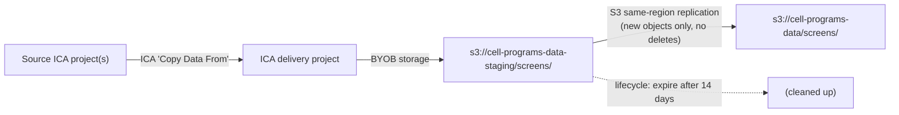

# ICA → S3 data delivery: `cell-programs-data/screens`

This document describes how data is delivered from Illumina Connected Analytics (ICA) projects to the S3 bucket `cell-programs-data` under the prefix `screens/`, and lists every setting required to build or rebuild the setup.

**Assumptions used throughout:** the ICA region is US (N. Virginia), so the AWS region is `us-east-1` and the ICA namespace is `use1`. Placeholders in `<ANGLE_BRACKETS>` must be replaced with real values.

---

## 1. Overview

### Goal

- Project managers can deliver data from any ICA project to `s3://cell-programs-data/screens/...` using only the ICA web UI (or the `icav2` CLI).
- Nobody handles AWS credentials during a delivery.
- Neither ICA nor its users can delete or overwrite data in the final bucket.

### How it works

Instead of giving ICA access to the final bucket, ICA writes to a **staging bucket** that is attached to a dedicated ICA **delivery project** ("bring your own bucket", BYOB). S3 **same-region replication** copies every new object from the staging bucket to the final bucket. **Deletes are not replicated**, and the final bucket is versioned, so nothing done in ICA can remove or destroy data that has been delivered.



### Components

| Component | Name | Purpose |
|---|---|---|
| Final bucket | `cell-programs-data` | Permanent home of delivered data (`screens/` prefix) |
| Staging bucket | `cell-programs-data-staging` | ICA-managed landing zone (`screens/` prefix) |
| ICA delivery project | `<DELIVERY_PROJECT>` | ICA project backed by the staging bucket |
| ICA storage credential | `<ICA_STORAGE_CREDENTIAL>` | Credential ICA uses to access the staging bucket |
| ICA storage configuration | `<ICA_STORAGE_CONFIG>` | Connects the staging bucket + prefix to ICA |
| IAM user (ICA access) | `<ICA_IAM_USER>` | Identity whose access key is stored in ICA |
| Replication role | `s3-replication-cell-programs-staging-to-final` | Role S3 uses to replicate staging → final |
| Illumina cross-account role | `arn:aws:iam::079623148045:role/ica_use1_crossacct` | Role Illumina uses for copy/move between buckets |

### Path mapping

The delivery project's root corresponds to `screens/` in both buckets. Replication keeps keys unchanged, so:

| Path in ICA delivery project | Staging key | Final key |
|---|---|---|
| `/screen_1/sample1/file.bam` | `screens/screen_1/sample1/file.bam` | `screens/screen_1/sample1/file.bam` |

Folder names and structure must therefore be correct **in the delivery project at copy time**. See section 8.

---

## 2. Staging bucket: `cell-programs-data-staging`

### 2.1 General settings

| Setting | Value | Notes |
|---|---|---|
| Region | `us-east-1` | Must match the ICA project region |
| Object Ownership | **ACLs disabled (Bucket owner enforced)** | Required; otherwise objects written by Illumina stay owned by Illumina and copy jobs fail with 403 |
| Block Public Access | All four settings on | |
| Versioning | **Enabled** | Required for replication |
| Default encryption | SSE-S3 | SSE-KMS would need extra key permissions for ICA, Illumina's cross-account role and replication |
| Object Lock | Off | Staging data is temporary |
| Folder | `screens/` | ICA must not be connected to the bucket root |
| Event notifications | **Do not configure** | ICA manages the bucket's notification configuration (`s3:PutBucketNotification`) |

### 2.2 CORS (Permissions tab)

Required for uploads through the ICA web UI.

```json
[
  {
    "AllowedHeaders": ["*"],
    "AllowedMethods": ["HEAD", "GET", "PUT", "POST", "DELETE"],
    "AllowedOrigins": ["https://ica.illumina.com"],
    "ExposeHeaders": ["ETag", "x-amz-meta-custom-header"]
  }
]
```

### 2.3 Bucket policy

Allows Illumina's regional cross-account role to perform copy and move operations into this bucket (versioned-bucket variant). Without it, "Copy Data From" fails.

```json
{
  "Version": "2012-10-17",
  "Statement": [
    {
      "Sid": "AllowCrossAccountAccess",
      "Effect": "Allow",
      "Principal": { "AWS": "arn:aws:iam::079623148045:role/ica_use1_crossacct" },
      "Action": [
        "s3:PutObject",
        "s3:DeleteObject",
        "s3:ListMultipartUploadParts",
        "s3:AbortMultipartUpload",
        "s3:GetObject",
        "s3:GetObjectVersion",
        "s3:DeleteObjectVersion",
        "s3:GetObjectTagging",
        "s3:PutObjectTagging",
        "s3:GetObjectVersionTagging",
        "s3:PutObjectVersionTagging"
      ],
      "Resource": [
        "arn:aws:s3:::cell-programs-data-staging",
        "arn:aws:s3:::cell-programs-data-staging/*"
      ]
    }
  ]
}
```

### 2.4 Lifecycle rule `expire-staging`

Management → Lifecycle rules → Create lifecycle rule.

| Setting | Value |
|---|---|
| Scope | Apply to all objects in the bucket |
| Expire current versions of objects | 14 days after object creation |
| Permanently delete noncurrent versions | 1 day after objects become noncurrent (no newer versions retained) |
| Delete incomplete multipart uploads | 7 days |
| Delete expired object delete markers | Not selectable together with "expire current versions"; S3 removes expired delete markers automatically when a rule expires current versions by age |

---

## 3. ICA access to the staging bucket

The setup currently uses the **IAM user method** (long-term access key stored in ICA). See section 9.1 for the recommended migration to the IAM role method.

### 3.1 IAM user `<ICA_IAM_USER>`

- Programmatic access only (access key), no console access.
- Attached policy (versioned-bucket variant, scoped to the whole staging bucket):

```json
{
  "Version": "2012-10-17",
  "Statement": [
    {
      "Effect": "Allow",
      "Action": [
        "s3:PutBucketNotification",
        "s3:ListBucket",
        "s3:GetBucketNotification",
        "s3:GetBucketLocation",
        "s3:ListBucketVersions",
        "s3:GetBucketVersioning"
      ],
      "Resource": ["arn:aws:s3:::cell-programs-data-staging"]
    },
    {
      "Effect": "Allow",
      "Action": [
        "s3:PutObject",
        "s3:GetObject",
        "s3:RestoreObject",
        "s3:DeleteObject",
        "s3:DeleteObjectVersion",
        "s3:GetObjectVersion",
        "s3:GetObjectTagging",
        "s3:PutObjectTagging",
        "s3:GetObjectVersionTagging",
        "s3:PutObjectVersionTagging"
      ],
      "Resource": "arn:aws:s3:::cell-programs-data-staging/*"
    },
    {
      "Effect": "Allow",
      "Action": ["sts:GetFederationToken"],
      "Resource": ["*"]
    }
  ]
}
```

ICA can delete objects and object versions in the staging bucket. This is intentional: the staging bucket is disposable, and deletes are never replicated to the final bucket.

### 3.2 ICA settings

| Where in ICA | Setting | Value |
|---|---|---|
| System Settings → Credentials → Create → Storage Credential | Type | AWS user |
| | Access Key ID / Secret Access Key | Key of `<ICA_IAM_USER>` |
| System Settings → Storage → Create | Bucket name | `cell-programs-data-staging` |
| | Key prefix | `screens/` |
| | Storage credential | `<ICA_STORAGE_CREDENTIAL>` |
| | Validate | System Settings → Storage → select → Manage → Validate |
| Projects → Create | Storage | `<ICA_STORAGE_CONFIG>` |
| Delivery project | Members | Only people allowed to deliver data |

### 3.3 Source projects that also use their own buckets (BYOB)

If a **source** project stores its data in its own S3 bucket rather than Illumina-managed storage, that source bucket also needs the cross-account statement from section 2.3 (with its own bucket name in `Resource`). Without it, copies fail with:

> `DomainException: Error starting FileCopy job. One or more bucket permissions missing.`

---

## 4. Replication role: `s3-replication-cell-programs-staging-to-final`

IAM → Roles → Create role → Custom trust policy.

### 4.1 Trust policy

```json
{
  "Version": "2012-10-17",
  "Statement": [
    {
      "Effect": "Allow",
      "Principal": { "Service": "s3.amazonaws.com" },
      "Action": "sts:AssumeRole"
    }
  ]
}
```

### 4.2 Inline permissions policy

```json
{
  "Version": "2012-10-17",
  "Statement": [
    {
      "Sid": "ReadSourceReplicationConfig",
      "Effect": "Allow",
      "Action": ["s3:GetReplicationConfiguration", "s3:ListBucket"],
      "Resource": "arn:aws:s3:::cell-programs-data-staging"
    },
    {
      "Sid": "ReadSourceObjects",
      "Effect": "Allow",
      "Action": [
        "s3:GetObjectVersionForReplication",
        "s3:GetObjectVersionAcl",
        "s3:GetObjectVersionTagging"
      ],
      "Resource": "arn:aws:s3:::cell-programs-data-staging/screens/*"
    },
    {
      "Sid": "WriteDestinationObjects",
      "Effect": "Allow",
      "Action": ["s3:ReplicateObject", "s3:ReplicateTags"],
      "Resource": "arn:aws:s3:::cell-programs-data/screens/*"
    }
  ]
}
```

Design decisions:

- **`s3:ReplicateDelete` is deliberately omitted.** Even if delete marker replication were switched on by mistake, the role could not propagate deletes.
- The role can only write to `screens/` in the final bucket.
- Do not use the console's "Create new role" option in the replication wizard; the generated role includes `s3:ReplicateDelete` and broader scopes.

---

## 5. Replication rule on the staging bucket

`cell-programs-data-staging` → Management → Replication rules → Create replication rule.

| Setting | Value |
|---|---|
| Rule name | `screens-to-final` |
| Status | Enabled |
| Source scope | Limit using filters → prefix `screens/` |
| Destination | Bucket in this account → `cell-programs-data` |
| IAM role | Existing role `s3-replication-cell-programs-staging-to-final` |
| Replicate objects encrypted with AWS KMS | Off (SSE-S3 in use) |
| Destination storage class | Intelligent-Tiering (optional; avoids a later lifecycle transition) |
| Replication Time Control | Off |
| Replication metrics | **On** |
| **Delete marker replication** | **Off** (critical) |
| Replica modification sync | Off |
| Replicate existing objects | No (only needed if data already sits under `screens/` in staging) |

Behaviour:

- Only objects written **after** the rule was created are replicated. Use S3 Batch Replication for older objects.
- Replication is asynchronous and usually completes within minutes. Very large objects take longer.
- Replication is server-side within `us-east-1`; no data passes through other machines and there is no data transfer charge.

---

## 6. Final bucket: `cell-programs-data`

### 6.1 General settings

| Setting | Value | Notes |
|---|---|---|
| Versioning | **Enabled** | Required for replication; keeps previous versions on overwrite or delete |
| ICA access | **None** | Neither the ICA IAM user nor Illumina's roles have any permissions here |
| Writers to `screens/` | Replication role only (plus administrators) | |

### 6.2 Lifecycle rules

The existing Intelligent-Tiering rule (`auto-intelligent-tiering`) is left unchanged. It may be centrally managed, so it should not be edited by hand. A **separate** rule handles versioning:

| Setting | Value |
|---|---|
| Rule name | `noncurrent-versions` |
| Scope | All objects (or `screens/` only) |
| Permanently delete noncurrent versions | `<RECOVERY_DAYS>` days after objects become noncurrent (recommended 30–90) |
| Delete expired object delete markers | On |
| Delete incomplete multipart uploads | 7 days |
| **Expire current versions of objects** | **Never select this on the final bucket** |

`<RECOVERY_DAYS>` is the window in which an accidental overwrite or delete in the final bucket can still be undone.

### 6.3 Recommended hardening: deny-deletes bucket policy (not yet applied)

Restricts deletion of delivered data and changes to the protective settings to a single break-glass identity. Coordinate with other users of the bucket first, and test carefully to avoid locking out legitimate users.

```json
{
  "Version": "2012-10-17",
  "Statement": [
    {
      "Sid": "ProtectDeliveredData",
      "Effect": "Deny",
      "Principal": "*",
      "Action": ["s3:DeleteObject", "s3:DeleteObjectVersion"],
      "Resource": "arn:aws:s3:::cell-programs-data/screens/*",
      "Condition": {
        "ArnNotLike": {
          "aws:PrincipalArn": "arn:aws:iam::<ACCOUNT_ID>:role/aws-reserved/sso.amazonaws.com/*AWSReservedSSO_<BREAK_GLASS_PERMISSION_SET>_*"
        }
      }
    },
    {
      "Sid": "ProtectBucketSettings",
      "Effect": "Deny",
      "Principal": "*",
      "Action": ["s3:PutBucketVersioning", "s3:PutLifecycleConfiguration"],
      "Resource": "arn:aws:s3:::cell-programs-data",
      "Condition": {
        "ArnNotLike": {
          "aws:PrincipalArn": "arn:aws:iam::<ACCOUNT_ID>:role/aws-reserved/sso.amazonaws.com/*AWSReservedSSO_<BREAK_GLASS_PERMISSION_SET>_*"
        }
      }
    }
  ]
}
```

Notes:

- The replication role only needs `s3:ReplicateObject` and `s3:ReplicateTags`, which this policy does not deny.
- Lifecycle actions performed by S3 itself are not affected by bucket policies.
- `s3:PutBucketPolicy` is intentionally not denied to avoid lock-out.
- Merge these statements into any existing bucket policy rather than replacing it.

---

## 7. Monitoring

| What | How |
|---|---|
| Failed replication | CloudWatch alarm on the S3 replication metric `OperationsFailedReplication` for rule `screens-to-final`, threshold > 0 |
| Replication backlog (optional) | Metrics `BytesPendingReplication` / `OperationsPendingReplication` |
| Per-object status | Staging object → Properties → Replication status (`PENDING`, `COMPLETED`, `FAILED`); final object shows `REPLICA` |

Do **not** use S3 event notifications on the staging bucket for alerting, because ICA manages that bucket's notification configuration.

---

## 8. Operating procedure: delivering data

### 8.1 Delivering a folder under a new name

Example: deliver `samples/sample_id_123/` from a source project to `s3://cell-programs-data/screens/screen_1/sample1/`.

1. In the delivery project, create the folders `screen_1/` and `screen_1/sample1/`.
2. Open `screen_1/sample1/` and choose **Manage → Copy Data From**.
3. In the source project, open `samples/sample_id_123/` and select **everything inside it**, not the folder itself. (Copying the folder would create `screen_1/sample1/sample_id_123/`.) Subfolders are copied with their contents.
4. Start the copy and follow progress under **Activity → Batch Jobs**.
5. Within a few minutes of the copy finishing, the files appear under `s3://cell-programs-data/screens/screen_1/sample1/`.

### 8.2 Rules for project managers

- **Get the structure right before copying.** Do not rename or move folders in the delivery project afterwards: the new paths would be replicated, but removal of the old paths would not, leaving both in the final bucket.
- **Use a new, unique folder per delivery** (for example per screen and sample) so new files never land on existing keys.
- **Mistakes:** delete the wrong copy in ICA, copy again correctly, and ask an administrator to remove the stray files from the final bucket.
- **Deleting in the delivery project is safe.** It only affects the staging bucket.

### 8.3 What happens when...

| Action | Staging bucket | Final bucket |
|---|---|---|
| File copied into delivery project | New object | Replicated within minutes |
| File deleted in delivery project | Delete marker created | **Unchanged** |
| File overwritten in delivery project | New version | New version replicated; previous version kept as noncurrent for `<RECOVERY_DAYS>` days |
| Folder renamed or moved in delivery project | New keys + delete markers | New keys replicated; **old keys remain** |
| 14 days pass | Objects expire (lifecycle) | **Unchanged** |

---

## 9. Caveats and follow-ups

### 9.1 IAM user credential (follow-up)

The storage credential is a long-term access key. Recommended:

- Migrate to the ICA **IAM role method** (OIDC identity provider + role with 12-hour maximum session; no stored keys).
- Until then, rotate the access key regularly (create a new key, update the ICA storage credential, then deactivate and delete the old key).
- Expect Security Hub findings for IAM user access keys in the LZA environment.

### 9.2 Landing Zone Accelerator (LZA) guardrails

- **SCPs** apply to identities in our organization (including `<ICA_IAM_USER>`), and can block actions such as `s3:DeleteObjectVersion`.
- **RCPs** apply to external principals such as Illumina's `ica_use1_crossacct` role, and can block copies even when the bucket policy is correct.
- Any IAM resources should ideally be deployed through LZA (for example as a customizations CloudFormation stack) to avoid configuration drift.

### 9.3 ICA behaviour to keep in mind

- **Copy pre-check test files.** ICA writes a temporary test file before each copy. If it lands under `screens/`, it is replicated before ICA deletes it and remains in the final bucket. Check the final bucket periodically for unexpected small files.
- **Lifecycle expiry and the ICA listing.** Objects expired by the staging lifecycle rule may remain visible in the delivery project. If so, delete deliveries in ICA after confirming they reached the final bucket.
- **Region.** The staging bucket must remain in the same AWS region as the ICA project.
- **Empty folders.** S3 sends no events for folders, so moving or deleting folders directly in S3 leaves empty folders visible in ICA.

---

## 10. Troubleshooting

| Symptom | Likely cause | Fix |
|---|---|---|
| `Error starting FileCopy job. One or more bucket permissions missing.` | Cross-account statement missing on the staging bucket **or the source bucket** (BYOB source projects) | Add the section 2.3 statement to the bucket in question |
| Copy fails with 403 / stalls | Object Ownership not set to "Bucket owner enforced"; SSE-KMS without key permissions; RCP blocking Illumina | Fix ownership; use SSE-S3; ask platform team about RCPs |
| Leftover small test files in staging | ICA pre-check could not clean up (versioned-bucket permissions missing, or SCP) | Check the IAM user policy and SCPs; delete the files |
| Storage configuration won't validate | Wrong credential, wrong bucket name in policy, organization policies | Check the IAM policy resource ARNs; see ICA troubleshooting docs |
| Replication status `FAILED` | Replication role permissions; key outside `screens/` in final bucket; KMS | Check the role policy in section 4.2 |
| Nothing replicates | Rule disabled, wrong prefix (`screens` without `/`), or object older than the rule | Check the rule; use Batch Replication for old objects |

---

## 11. Verification checklist

- [ ] Upload a small file through the ICA UI into the delivery project; it appears under `screens/` in staging.
- [ ] "Copy Data From" a source project works (including BYOB source projects).
- [ ] Staging object's replication status becomes `COMPLETED`.
- [ ] File appears in `s3://cell-programs-data/screens/...` with status `REPLICA`.
- [ ] Deleting the file in ICA leaves the final bucket's copy untouched.
- [ ] CloudWatch alarm for `OperationsFailedReplication` exists.
- [ ] After 14 days, test objects are gone from staging, still present in the final bucket.

---

## 12. References

- ICA – Connect AWS S3 bucket: https://help.ica.illumina.com/home/h-storage/s-awss3
- ICA – IAM role method: https://help.ica.illumina.com/home/h-storage/s-awss3/iam-role-method
- ICA – IAM user method: https://help.connected.illumina.com/connected-analytics/home/h-storage/s-awss3/iam-user-method
- ICA – Data copy and move: https://help.connected.illumina.com/illumina-connected-analytics/project/p-data
- AWS – S3 replication: https://docs.aws.amazon.com/AmazonS3/latest/userguide/replication.html
- AWS – S3 lifecycle: https://docs.aws.amazon.com/AmazonS3/latest/userguide/object-lifecycle-mgmt.html
